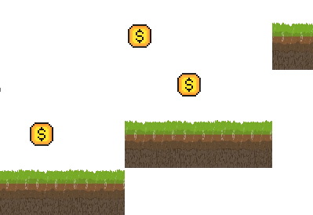
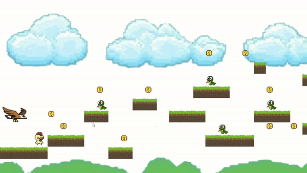
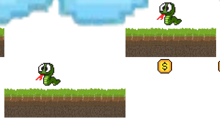
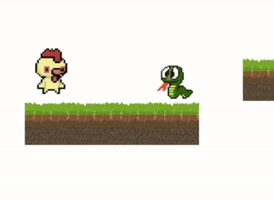

# Table of Contents

- [Design Principle](#design-principle)
- [Design Pattern](#design-pattern)
- [Additional Game Features](#additional-game-features)
- [Test Cases](#test-cases)

# Design Principle

## **1.Single Responsibility Principle (SRP)**

Each class focuses on a specific responsibility.For example, `GameInitializer` handles initializing game elements and setting up the game environment, while`HighScoreUtils` focuses on managing high score data.

[GameInitializer.java](PlatformerPlain/src/main/java/com/example/platformerplain/util/GameInitializer.java)  
[HighScoreUtils.java](PlatformerPlain/src/main/java/com/example/platformerplain/util/HighScoreUtils.java)

## **2.Open-Closed Principle (OCP)**

The `InputHandler` class allow new commands to be added without modifying existing code.New key-command mappings can be added using `setCommand()` method.

[InputHandler.java](PlatformerPlain/src/main/java/com/example/platformerplain/controller/InputHandler.java)

## **3.Encapsulation**

Encapsulation is used in `GameStateController` to manage the game's state logic like transitioning between states. By keeping the state objects private and exposing them only through controlled methods, it ensures data integrity and makes the class easier to maintain and extend.

[GameStateController.java](PlatformerPlain/src/main/java/com/example/platformerplain/controller/GameStateController.java)

# Design Pattern

## **1. Command Pattern**

The <b>Command Pattern</b> is used to handle player's moving, jumping and shooting. Each action is encapsulated in a command object, which decouples the input handling from the action logic. This makes the code more maintainable and easier to modify or extend by adding new actions without modifying the input handling logic.

[Command package](PlatformerPlain/src/main/java/com/example/platformerplain/command)  
[InputHandler.java](PlatformerPlain/src/main/java/com/example/platformerplain/controller/InputHandler.java)

## **2. Singleton Pattern**

The <b>Singleton Pattern</b> in `BackgroundManager` ensures only one instance of `BackgroundManager` exists handles background settings like color.This guarantees consistency across the game and allow global access to update background, simplifying background management and prevent conflicts.

[BackgroundManager.java](PlatformerPlain/src/main/java/com/example/platformerplain/controller/BackgroundManager.java)

## **3. Factory Pattern**

The <b>Factory Pattern</b> is used to create different screen instance like MainScreen, OptionScreen and EndScreen based on the game state.It centralizes object creation, separates the client from specific details. This makes it easier to add new screens without changing existing code.

[ScreenType.java](PlatformerPlain/src/main/java/com/example/platformerplain/config/ScreenType.java)  
[ScreenFactory.java](PlatformerPlain/src/main/java/com/example/platformerplain/util/ScreenFactory.java)  
[Screen.java](PlatformerPlain/src/main/java/com/example/platformerplain/view/Screen.java)  
[MainScreen.java](PlatformerPlain/src/main/java/com/example/platformerplain/view/MainScreen.java)  
[OptionScreen.java](PlatformerPlain/src/main/java/com/example/platformerplain/view/OptionScreen.java)  
[InfoScreen.java](PlatformerPlain/src/main/java/com/example/platformerplain/view/InfoScreen.java)  
[EndScreen.java](PlatformerPlain/src/main/java/com/example/platformerplain/view/EndScreen.java)

## **4. State Pattern**

The <b>State Pattern</b> handles game states like PlayingState, LevelPassState and GameOverState.It separate classes for each state based on GameState interface.This keeps the game controller clean, as each state handles its own logic. The `GameStateController` switches between states, making it easy to add or modify states without impacting existing code, following the <b>Open-Closed Principle</b>.

[State package](PlatformerPlain/src/main/java/com/example/platformerplain/state)  
[GameStateController.java](PlatformerPlain/src/main/java/com/example/platformerplain/controller/GameStateController.java)

## **5.Observer Pattern**

The <b>Observer Pattern</b> is used in the game to manage dynamic updates to the score. The `ScoreModel` (subject) maintains the score and notifies its observers `ScoreView` whenever score changes. Observers implement the `ScoreObserver` interface to handle real-time updates. This ensures loose coupling,separates game logic from the UI and allows easy addition or removal of observers.

[Observer Package](PlatformerPlain/src/main/java/com/example/platformerplain/observer)

# Additional Game Features

## **1. Collectibles**

<ul>
  <li><strong>Introduce money collectibles on platforms.</strong>
    <ul>
      <li>Players can collect these money items to gain <strong>100 points</strong> per item.</li>
      <li></li>
    </ul>
  </li>
</ul>

## **2. Enemies**

<ul>
  <li><strong>All levels contain a flying enemy (eagle), that will catch the player (chicken).</strong>
    <ul>
      <li>The eagle flies in the sky to catch the player.</li>
      <li>If the eagle catches the player, the <strong>game is over</strong>.</li>
      <li></li>
    </ul>
  </li>
</ul>

## **3. Level System**

<ul>
  <li><strong>Introduce a level system where the difficulty increases with each level.</strong>
    <ul>
      <li>Player can choose the level they want to play.</li>
      <li>The eagle becomes faster and platforms is more challenging as the levels progress.</li>
    </ul>
  </li>
</ul>

## **4. Obstacles**

<ul>
  <li><strong>Introduce obstacles (snakes) on platforms.</strong>
    <ul>
      <li>If the player collides with a snake, they lose <strong>100 points</strong>.</li>
      <li></li>
    </ul>
  </li>
</ul>

## **5. Shooting Function**

<ul>
  <li><strong>The chicken player has the ability to shoot to eliminate obstacles.</strong>
    <ul>
      <li>Player can press the <b>Spacebar</b> to shoot at obstacles (snakes) on the platform to avoid losing points.</li>
      <li></li>
    </ul>
  </li>
</ul>

# Test Cases

## MainScreenControllerTest

<table>
  <thead>
    <tr>
      <th><strong>Test Case ID</strong></th>
      <th><strong>Description</strong></th>
      <th><strong>Input</strong></th>
      <th><strong>Expected Output</strong></th>
      <th><strong>Actual Output</strong></th>
      <th><strong>Status</strong></th>
      <th><strong>Dependencies</strong></th>
    </tr>
  </thead>
  <tbody>
    <tr>
      <td>TC_MS_01</td>
      <td>Verify "Start Game" button initializes game and displays level info.</td>
      <td>Click <code>#startGameBtn</code>.   Check level info.</td>
      <td>Level is selected and displayed correctly.</td>
      <td>Level is selected and displayed correctly.</td>
      <td><strong>Pass</strong></td>
      <td>None</td>
    </tr>
    <tr>
      <td>TC_MS_02</td>
      <td>Verify "Option" button navigates to options screen.</td>
      <td>Click <code>#optionBtn</code>.</td>
      <td>Options screen is shown.</td>
      <td>Options screen is shown.</td>
      <td><strong>Pass</strong></td>
      <td>None</td>
    </tr>
    <tr>
      <td>TC_MS_03</td>
      <td>Verify "Info" button navigates to info screen.</td>
      <td>Click <code>#infoBtn</code>.</td>
      <td>Information screen is shown.</td>
      <td>Information screen is shown.</td>
      <td><strong>Pass</strong></td>
      <td>None</td>
    </tr>
    <tr>
      <td>TC_MS_04</td>
      <td>Verify "Exit Game" button closes the game.</td>
      <td>Click <code>#exitGameBtn</code>.</td>
      <td>Game window is closed.</td>
      <td>Game window is closed.</td>
      <td><strong>Pass</strong></td>
      <td>None</td>
    </tr>
  </tbody>
</table>

## InfoScreenControllerTest

<table>
  <thead>
    <tr>
      <th><strong>Test Case ID</strong></th>
      <th><strong>Description</strong></th>
      <th><strong>Input</strong></th>
      <th><strong>Expected Output</strong></th>
      <th><strong>Actual Output</strong></th>
      <th><strong>Status</strong></th>
      <th><strong>Dependencies</strong></th>
    </tr>
  </thead>
  <tbody>
    <tr>
      <td>TC_IS_01</td>
      <td>Verify "Back to Menu" button navigates to main screen.</td>
      <td>Click <code>#backToMenuBtn</code>.</td>
      <td>Main screen is displayed.</td>
      <td>Main screen is displayed.</td>
      <td><strong>Pass</strong></td>
      <td>None</td>
    </tr>
  </tbody>
</table>

## OptionScreenControllerTest

<table>
  <thead>
    <tr>
      <th><strong>Test Case ID</strong></th>
      <th><strong>Description</strong></th>
      <th><strong>Input</strong></th>
      <th><strong>Expected Output</strong></th>
      <th><strong>Actual Output</strong></th>
      <th><strong>Status</strong></th>
      <th><strong>Dependencies</strong></th>
    </tr>
  </thead>
  <tbody>
    <tr>
      <td>TC_OS_01</td>
      <td>Verify "Apply" button applies selected color.</td>
      <td>Select <code>Color.RED</code> in colorPicker.</td>
      <td>Background color is set to <code>Color.RED</code>.</td>
      <td>Background color is set to <code>Color.RED</code>.</td>
      <td><strong>Pass</strong></td>
      <td>None</td>
    </tr>
    <tr>
      <td>TC_OS_02</td>
      <td>Verify "Back to Menu" button navigates to main screen.</td>
      <td>Click <code>#backToMenuBtn</code>.</td>
      <td>Main screen is displayed.</td>
      <td>Main screen is displayed.</td>
      <td><strong>Pass</strong></td>
      <td>None</td>
    </tr>
  </tbody>
</table>

## EndScreenControllerTest

<table>
  <thead>
    <tr>
      <th><strong>Test Case ID</strong></th>
      <th><strong>Description</strong></th>
      <th><strong>Input</strong></th>
      <th><strong>Expected Output</strong></th>
      <th><strong>Actual Output</strong></th>
      <th><strong>Status</strong></th>
      <th><strong>Dependencies</strong></th>
    </tr>
  </thead>
  <tbody>
    <tr>
      <td>TC_ES_01</td>
      <td>Verify "Play Again" button re-initializes the game.</td>
      <td>Click <code>#playAgainBtn</code>.</td>
      <td>Game state re-initialized with level data.</td>
      <td>Game state re-initialized with level data.</td>
      <td><strong>Pass</strong></td>
      <td>None</td>
    </tr>
    <tr>
      <td>TC_ES_02</td>
      <td>Verify "Exit Game" button closes the application.</td>
      <td>Click <code>#exitGameBtn</code>.</td>
      <td>Application closes successfully.</td>
      <td>Application closes successfully.</td>
      <td><strong>Pass</strong></td>
      <td>None</td>
    </tr>
    <tr>
      <td>TC_ES_03</td>
      <td>Verify "Back to Menu" button navigates to main screen.</td>
      <td>Click <code>#backToMenuBtn</code>.</td>
      <td>Main screen is displayed.</td>
      <td>Main screen is displayed.</td>
      <td><strong>Pass</strong></td>
      <td>None</td>
    </tr>
    <tr>
      <td>TC_ES_04</td>
      <td>Verify "Next Level" button initializes the next level.</td>
      <td>Click <code>#nextLevelBtn</code>.</td>
      <td>Next level initialized and data updated.</td>
      <td>Next level initialized and data updated.</td>
      <td><strong>Pass</strong></td>
      <td>None</td>
    </tr>
    <tr>
      <td>TC_ES_05</td>
      <td>Verify "Toggle High Scores" button displays high scores pane.</td>
      <td>Click <code>#toggleHighScoresBtn</code>.</td>
      <td>High scores pane is visible.</td>
      <td>High scores pane is visible.</td>
      <td><strong>Pass</strong></td>
      <td>None</td>
    </tr>
  </tbody>
</table>

## PlayerControllerTest

<table>
  <thead>
    <tr>
      <th><strong>Test Case ID</strong></th>
      <th><strong>Description</strong></th>
      <th><strong>Input</strong></th>
      <th><strong>Expected Output</strong></th>
      <th><strong>Actual Output</strong></th>
      <th><strong>Status</strong></th>
      <th><strong>Dependencies</strong></th>
    </tr>
  </thead>
  <tbody>
    <tr>
      <td>TC_PC_01</td>
      <td>Verify player moves correctly along the X-axis.</td>
      <td>Call <code>moveX(5)</code>.</td>
      <td>Player's X position is updated to <code>5</code>.</td>
      <td>Player's X position is updated to <code>5</code>.</td>
      <td><strong>Pass</strong></td>
      <td>None</td>
    </tr>
    <tr>
      <td>TC_PC_02</td>
      <td>Verify player can jump and updates velocity.</td>
      <td>Set <code>canJump = true</code>.   Call <code>jump()</code>.</td>
      <td>Player's velocity is updated to <code>(0, -30)</code>.</td>
      <td>Player's velocity is updated to <code>(0, -30)</code>.</td>
      <td><strong>Pass</strong></td>
      <td>None</td>
    </tr>
  </tbody>
</table>

## FireballControllerTest

<table>
  <thead>
    <tr>
      <th><strong>Test Case ID</strong></th>
      <th><strong>Description</strong></th>
      <th><strong>Input</strong></th>
      <th><strong>Expected Output</strong></th>
      <th><strong>Actual Output</strong></th>
      <th><strong>Status</strong></th>
      <th><strong>Dependencies</strong></th>
    </tr>
  </thead>
  <tbody>
    <tr>
      <td>TC_FB_01</td>
      <td>Verify fireball is created and initialized correctly.</td>
      <td>Call <code>shootFireball(0, 0)</code>.</td>
      <td>Fireball's position is <code>(0, 0)</code>, speed is <code>10.0</code>.</td>
      <td>Fireball's position is <code>(0, 0)</code>, speed is <code>10.0</code>.</td>
      <td><strong>Pass</strong></td>
      <td>None</td>
    </tr>
    <tr>
      <td>TC_FB_02</td>
      <td>Verify list of active fireballs is retrieved correctly.</td>
      <td>Shoot one fireball, call <code>getFireballs()</code>.</td>
      <td>Fireballs list contains <code>1</code> fireball.</td>
      <td>Fireballs list contains <code>1</code> fireball.</td>
      <td><strong>Pass</strong></td>
      <td>None</td>
    </tr>
    <tr>
      <td>TC_FB_03</td>
      <td>Verify fireball is removed correctly.</td>
      <td>Shoot one fireball, call <code>removeFireball()</code>.</td>
      <td>Fireballs list is empty after removal.</td>
      <td>Fireballs list is empty after removal.</td>
      <td><strong>Pass</strong></td>
      <td>None</td>
    </tr>
  </tbody>
</table>

## GamePhysicsTest

<table>
  <thead>
    <tr>
      <th><strong>Test Case ID</strong></th>
      <th><strong>Description</strong></th>
      <th><strong>Input</strong></th>
      <th><strong>Expected Output</strong></th>
      <th><strong>Actual Output</strong></th>
      <th><strong>Status</strong></th>
      <th><strong>Dependencies</strong></th>
    </tr>
  </thead>
  <tbody>
    <tr>
      <td>TC_GP_01</td>
      <td>Verify gravity is applied correctly to the player.</td>
      <td>Player with <code>velocity = (0, 0)</code>. Call <code>applyGravity()</code>.</td>
      <td>Player's <code>velocity</code> changes to <code>(0, 1)</code>.</td>
      <td>Player's <code>velocity</code> changes to <code>(0, 1)</code>.</td>
      <td><strong>Pass</strong></td>
      <td>None</td>
    </tr>
    <tr>
      <td>TC_GP_02</td>
      <td>Verify collision detection on X-axis.</td>
      <td>Add a platform at <code>(5, 0)</code>. Call <code>checkCollisionX(player, true)</code>.</td>
      <td>No collision is detected.</td>
      <td>No collision is detected.</td>
      <td><strong>Pass</strong></td>
      <td>None</td>
    </tr>
    <tr>
      <td>TC_GP_03</td>
      <td>Verify collision detection on Y-axis.</td>
      <td>Add a platform at <code>(0, 5)</code>. Call <code>checkCollisionY(player, true)</code>.</td>
      <td>No collision is detected.</td>
      <td>No collision is detected.</td>
      <td><strong>Pass</strong></td>
      <td>None</td>
    </tr>
    <tr>
      <td>TC_GP_04</td>
      <td>Verify no collision is detected when no platforms exist.</td>
      <td>No platforms added. Call <code>checkCollisionX()</code> and <code>checkCollisionY()</code>.</td>
      <td>No collision is detected on both axes.</td>
      <td>No collision is detected on both axes.</td>
      <td><strong>Pass</strong></td>
      <td>None</td>
    </tr>
  </tbody>
</table>

## GameStateControllerTest

<table>
  <thead>
    <tr>
      <th><strong>Test Case ID</strong></th>
      <th><strong>Description</strong></th>
      <th><strong>Input</strong></th>
      <th><strong>Expected Output</strong></th>
      <th><strong>Actual Output</strong></th>
      <th><strong>Status</strong></th>
      <th><strong>Dependencies</strong></th>
    </tr>
  </thead>
  <tbody>
    <tr>
      <td>TC_GSC_01</td>
      <td>Verify the initial state is the playing state.</td>
      <td>Call <code>getCurrentState()</code> after initialization.</td>
      <td>Initial state is <code>playingState</code>.</td>
      <td>Initial state is <code>playingState</code>.</td>
      <td><strong>Pass</strong></td>
      <td>None</td>
    </tr>
    <tr>
      <td>TC_GSC_02</td>
      <td>Verify transition to the game end state.</td>
      <td>Call <code>setState(gameEndState)</code>.</td>
      <td>Current state is <code>gameEndState</code>.</td>
      <td>Current state is <code>gameEndState</code>.</td>
      <td><strong>Pass</strong></td>
      <td>None</td>
    </tr>
    <tr>
      <td>TC_GSC_03</td>
      <td>Verify transition to the level pass state.</td>
      <td>Call <code>setState(levelPassState)</code>.</td>
      <td>Current state is <code>levelPassState</code>.</td>
      <td>Current state is <code>levelPassState</code>.</td>
      <td><strong>Pass</strong></td>
      <td>None</td>
    </tr>
  </tbody>
</table>

## InputHandlerTest

<table>
  <thead>
    <tr>
      <th><strong>Test Case ID</strong></th>
      <th><strong>Description</strong></th>
      <th><strong>Input</strong></th>
      <th><strong>Expected Output</strong></th>
      <th><strong>Actual Output</strong></th>
      <th><strong>Status</strong></th>
      <th><strong>Dependencies</strong></th>
    </tr>
  </thead>
  <tbody>
    <tr>
      <td>TC_IH_01</td>
      <td>Verify command is set and retrieved for a key press.</td>
      <td>Call <code>setCommand(KeyCode.SPACE, mockCommand)</code> and check <code>isPressed</code>.</td>
      <td>Command is set, and key is marked as pressed.</td>
      <td>Command is set, and key is marked as pressed.</td>
      <td><strong>Pass</strong></td>
      <td>None</td>
    </tr>
    <tr>
      <td>TC_IH_02</td>
      <td>Verify key press executes the associated command.</td>
      <td>Call <code>setCommand(KeyCode.SPACE, mockCommand)</code> and <code>handlePlayerInput()</code>.</td>
      <td>Command is executed when key is pressed.</td>
      <td>Command is executed when key is pressed.</td>
      <td><strong>Pass</strong></td>
      <td>None</td>
    </tr>
    <tr>
      <td>TC_IH_03</td>
      <td>Verify key release updates key state correctly.</td>
      <td>Call <code>setKeyPressed(KeyCode.SPACE, false)</code> and check <code>isPressed</code>.</td>
      <td>Key is not pressed after release.</td>
      <td>Key is not pressed after release.</td>
      <td><strong>Pass</strong></td>
      <td>None</td>
    </tr>
  </tbody>
</table>

## MoneyControllerTest

<table>
  <thead>
    <tr>
      <th><strong>Test Case ID</strong></th>
      <th><strong>Description</strong></th>
      <th><strong>Input</strong></th>
      <th><strong>Expected Output</strong></th>
      <th><strong>Actual Output</strong></th>
      <th><strong>Status</strong></th>
      <th><strong>Dependencies</strong></th>
    </tr>
  </thead>
  <tbody>
    <tr>
      <td>TC_MC_01</td>
      <td>Verify money items are correctly added to the controller.</td>
      <td>Call <code>addMoney(100, 100)</code> and check money list and entity position.</td>
      <td>Money item added at (100, 100), list size = 1.</td>
      <td>Money item added at (100, 100), list size = 1.</td>
      <td><strong>Pass</strong></td>
      <td>None</td>
    </tr>
    <tr>
      <td>TC_MC_02</td>
      <td>Verify player collects money and item is removed.</td>
      <td>Add a money item at (0, 0), call <code>collectMoney(player)</code>.</td>
      <td>Money is removed from list and parent node, collected count = 1.</td>
      <td>Money is removed from list and parent node, collected count = 1.</td>
      <td><strong>Pass</strong></td>
      <td>Money entity and Player.</td>
    </tr>
  </tbody>
</table>

## ScoreControllerTest

<table>
  <thead>
    <tr>
      <th><strong>Test Case ID</strong></th>
      <th><strong>Description</strong></th>
      <th><strong>Input</strong></th>
      <th><strong>Expected Output</strong></th>
      <th><strong>Actual Output</strong></th>
      <th><strong>Status</strong></th>
      <th><strong>Dependencies</strong></th>
    </tr>
  </thead>
  <tbody>
    <tr>
      <td>TC_SC_01</td>
      <td>Verify score updates correctly using <code>update</code> method.</td>
      <td>Set score to 100, call <code>update</code>.</td>
      <td>Score in model = 100.</td>
      <td>Score in model = 100.</td>
      <td><strong>Pass</strong></td>
      <td>ScoreModel.</td>
    </tr>
    <tr>
      <td>TC_SC_02</td>
      <td>Verify score resets correctly using <code>reset</code> method.</td>
      <td>Set score to 100, call <code>reset</code>.</td>
      <td>Score in model = 0.</td>
      <td>Score in model = 0.</td>
      <td><strong>Pass</strong></td>
      <td>ScoreModel.</td>
    </tr>
    <tr>
      <td>TC_SC_03</td>
      <td>Verify score decrements by 100 on snake collision.</td>
      <td>Set score to 500, call <code>handleSnakeCollision</code>.</td>
      <td>Score in model = 400.</td>
      <td>Score in model = 400.</td>
      <td><strong>Pass</strong></td>
      <td>Player, ScoreModel.</td>
    </tr>
    <tr>
      <td>TC_SC_04</td>
      <td>Verify score increments by 500 on level pass.</td>
      <td>Set score to 1000, call <code>handleLevelPass</code>.</td>
      <td>Score in model = 1500.</td>
      <td>Score in model = 1500.</td>
      <td><strong>Pass</strong></td>
      <td>Player, ScoreModel.</td>
    </tr>
  </tbody>
</table>

## PlayerTest

<table>
  <thead>
    <tr>
      <th><strong>Test Case ID</strong></th>
      <th><strong>Description</strong></th>
      <th><strong>Input</strong></th>
      <th><strong>Expected Output</strong></th>
      <th><strong>Actual Output</strong></th>
      <th><strong>Status</strong></th>
      <th><strong>Dependencies</strong></th>
    </tr>
  </thead>
  <tbody>
    <tr>
      <td>TC_P_01</td>
      <td>Verify that the player entity is initialized correctly.</td>
      <td>Call <code>getEntity()</code> on Player instance.</td>
      <td>Player entity should have fit width = 70, height = 70, X = 0, Y = 500.</td>
      <td>Entity width = 70, height = 70, X = 0, Y = 500.</td>
      <td><strong>Pass</strong></td>
      <td>ImageView, Player</td>
    </tr>
    <tr>
      <td>TC_P_02</td>
      <td>Verify that player's velocity can be set and retrieved.</td>
      <td>Set velocity to <code>(5, 10)</code>, call <code>setVelocity()</code>, then <code>getVelocity()</code>.</td>
      <td>Velocity should be <code>(5, 10)</code> after being set and retrieved.</td>
      <td>Velocity = (5, 10).</td>
      <td><strong>Pass</strong></td>
      <td>Player</td>
    </tr>
    <tr>
      <td>TC_P_03</td>
      <td>Verify player's ability to jump can be set and retrieved.</td>
      <td>Set <code>canJump</code> to false, then true.</td>
      <td>Player's <code>canJump</code> state should be <code>false</code> and then <code>true</code>.</td>
      <td><code>canJump</code> = false, then <code>true</code>.</td>
      <td><strong>Pass</strong></td>
      <td>Player</td>
    </tr>
    <tr>
      <td>TC_P_04</td>
      <td>Verify player's movement state is detected correctly.</td>
      <td>Initially stationary, then move the player.</td>
      <td>Initially not moving, then moving after position change, and not moving after no further change.</td>
      <td>Initially not moving, then moving, then not moving.</td>
      <td><strong>Pass</strong></td>
      <td>Player</td>
    </tr>
  </tbody>
</table>

## HighScoreUtilsTest

<table>
  <thead>
    <tr>
      <th><strong>Test Case ID</strong></th>
      <th><strong>Description</strong></th>
      <th><strong>Input</strong></th>
      <th><strong>Expected Output</strong></th>
      <th><strong>Actual Output</strong></th>
      <th><strong>Status</strong></th>
      <th><strong>Dependencies</strong></th>
    </tr>
  </thead>
  <tbody>
    <tr>
      <td>TC_HS_01</td>
      <td>Verify reading high scores from an empty file.</td>
      <td>Call <code>readHighScores("Level 1")</code> with an empty score file.</td>
      <td>Should return an empty list.</td>
      <td>Returns empty list.</td>
      <td><strong>Pass</strong></td>
      <td>HighScoreUtils</td>
    </tr>
    <tr>
      <td>TC_HS_02</td>
      <td>Verify writing a high score to the file.</td>
      <td>Call <code>writeHighScore("Level 1", 100)</code>, then <code>readHighScores("Level 1")</code>.</td>
      <td>Should contain a list with one element: [100].</td>
      <td>List contains [100].</td>
      <td><strong>Pass</strong></td>
      <td>HighScoreUtils</td>
    </tr>
    <tr>
      <td>TC_HS_03</td>
      <td>Verify writing multiple high scores to the file.</td>
      <td>Call <code>writeHighScore("Level 1", 100)</code> and <code>writeHighScore("Level 1", 200)</code>, then <code>readHighScores("Level 1")</code>.</td>
      <td>Should return list in descending order: [200, 100].</td>
      <td>List contains [200, 100].</td>
      <td><strong>Pass</strong></td>
      <td>HighScoreUtils</td>
    </tr>
    <tr>
      <td>TC_HS_04</td>
      <td>Verify handling more than the maximum allowed high scores.</td>
      <td>Write more than 10 high scores, then read.</td>
      <td>Should return only the top 10 scores, in descending order.</td>
      <td>List contains 10 scores, top scores in descending order.</td>
      <td><strong>Pass</strong></td>
      <td>HighScoreUtils</td>
    </tr>
  </tbody>
</table>
